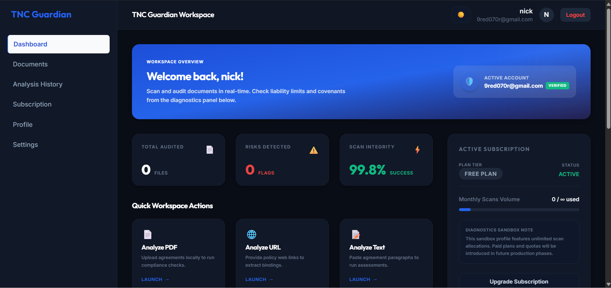
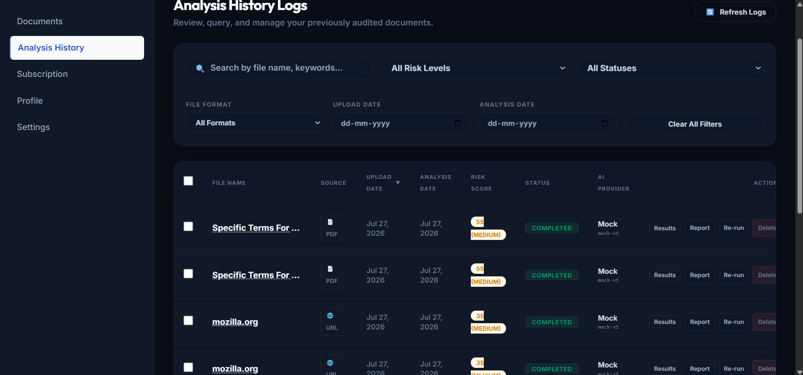

# 🛡️ TNC Guardian

<p align="center">
  <b>Understand Terms & Conditions before clicking "I Agree".</b>
</p>

<p align="center">
AI-Powered SaaS Platform that analyzes Terms & Conditions, Privacy Policies, and EULAs using Artificial Intelligence and OCR to help users understand legal documents in plain English.
</p>

<p align="center">


</p>

---

# 🌐 Live Demo

### Frontend

https://YOUR-FRONTEND-LINK

### Backend API

https://YOUR-BACKEND-LINK

---

# 📸 Application Preview

> Replace these placeholders with screenshots after deployment.

| Landing | Dashboard |
|----------|-----------|
|  |  |

| Upload | AI Analysis |
|----------|-----------|
|  |  |

| History |
|----------|
|  |

---

# 📖 About The Project

TNC Guardian is an AI-powered full-stack web application that helps users understand complex legal agreements before accepting them.

Instead of reading hundreds of lines of legal text, users can upload documents or provide URLs, and the system automatically:

- Extracts legal content
- Performs AI-powered analysis
- Detects risky clauses
- Generates simplified summaries
- Assigns an overall risk score

The platform is designed for:

- Students
- Professionals
- Freelancers
- Startups
- Small Businesses
- Anyone accepting online agreements

---

# ✨ Features

## 🔐 Authentication

- Secure User Registration
- Login System
- JWT Authentication
- Protected Routes
- Session Management

---

## 📄 Document Processing

- PDF Support
- DOCX Support
- TXT Support
- Website URL Analysis
- OCR Image Support (Optional)

---

## 🤖 AI Analysis

- Risk Score
- Clause Detection
- Privacy Risk Analysis
- Payment Clause Detection
- Subscription Detection
- Auto Renewal Detection
- Refund Policy Detection
- Plain English Summary
- Key Highlights
- Risk Categorization

---

## 📊 Dashboard

- User Analytics
- Recent Analyses
- Statistics
- Quick Actions

---

## 📚 History

- View Previous Reports
- Search
- Filter
- Delete
- Re-analyze Documents

---

## 🎨 User Experience

- Modern UI
- Dark Theme
- Fully Responsive
- Mobile Friendly
- Smooth Animations

---

# 🏗️ System Architecture

```
                   User
                     │
                     ▼
            React + TypeScript
                     │
          Axios REST API Calls
                     │
                     ▼
              FastAPI Backend
                     │
    ┌────────────────┼─────────────────┐
    │                │                 │
    ▼                ▼                 ▼
 PostgreSQL      OCR Engine       AI Analysis
 Database      Text Extraction       Engine
```

---

# 🛠 Tech Stack

| Category | Technology |
|-----------|------------|
| Frontend | React 19 |
| Language | TypeScript |
| Build Tool | Vite |
| Styling | Tailwind CSS |
| Routing | React Router |
| Forms | React Hook Form |
| State Management | Context API |
| Data Fetching | TanStack Query |
| Animation | Framer Motion |
| Backend | FastAPI |
| ORM | SQLAlchemy |
| Validation | Pydantic |
| Database | PostgreSQL |
| Authentication | JWT |
| OCR | EasyOCR |
| AI | OpenAI / Claude |
| Deployment | Render |
| Containerization | Docker |

---

# 📂 Project Structure

```
tnc-guardian/

├── frontend/
│   ├── src/
│   ├── public/
│   └── vite.config.ts
│
├── backend/
│   ├── app/
│   ├── migrations/
│   ├── requirements.txt
│   └── alembic.ini
│
├── docker/
├── docs/
├── docker-compose.yml
└── README.md
```

---

# 🚀 Getting Started

## Clone Repository

```bash
git clone https://github.com/YOUR_USERNAME/TNC-Guardian.git

cd TNC-Guardian
```

---

## Backend

```bash
cd backend

python -m venv venv

# Windows
venv\Scripts\activate

# Linux/macOS
source venv/bin/activate

pip install -r requirements.txt

uvicorn app.main:app --reload
```

---

## Frontend

```bash
cd frontend

npm install

npm run dev
```

---

# ⚙️ Environment Variables

Backend

```env
DATABASE_URL=

JWT_SECRET=

OPENAI_API_KEY=

ANTHROPIC_API_KEY=

OPENAI_MODEL=gpt-4o-mini

ENABLE_IMAGE_OCR=false
```

Frontend

```env
VITE_API_URL=
```

---

# 🚀 Deployment

## Frontend

- Render

## Backend

- Render

## Database

- PostgreSQL

---

# 📊 Project Highlights

- Full Stack Web Application
- JWT Authentication
- REST API Architecture
- AI Integration
- OCR Processing
- PostgreSQL Database
- Docker Support
- Production Deployment
- Responsive UI
- Dark Theme
- Modern Design
- Clean Architecture

---

# 💡 Challenges Solved

- Extracting text from different document formats
- AI prompt optimization
- OCR integration
- Secure authentication
- Route protection
- Production deployment
- Error handling
- Performance optimization

---

# 🔮 Future Scope

- Browser Extension
- Chrome Plugin
- Multi-language Support
- Team Workspaces
- Export Reports as PDF
- AI Chat Assistant
- Cloud Storage Integration
- Admin Dashboard
- Enterprise Version

---

# 📚 Learning Outcomes

This project strengthened practical knowledge of:

- Full Stack Development
- React
- FastAPI
- PostgreSQL
- Authentication
- REST APIs
- AI Integration
- OCR
- Docker
- Deployment
- Production Debugging
- Software Architecture

---

# 🤝 Contributing

Contributions are welcome.

If you would like to improve this project, feel free to fork the repository and submit a pull request.

---

# 📄 License

This project is licensed under the MIT License.

---

# 👨‍💻 Author

**Nikhil Negi**

- LinkedIn: https://linkedin.com/in/YOUR-LINKEDIN
- GitHub: https://github.com/YOUR-GITHUB

---

<p align="center">
⭐ If you found this project useful, consider giving it a star on GitHub.
</p>
