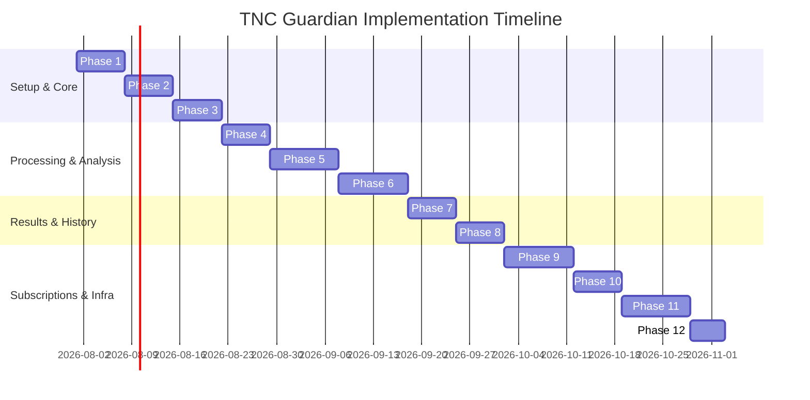

# Development Roadmap: TNC Guardian

This document defines the 12-phase development roadmap for **TNC Guardian**, breaking down implementation steps from project setup to production deployment.

---

## Roadmap Phases Overview

---

## Detailed Phase Breakdown

### Phase 1: Project Setup
*   **Objectives**: Initialize codebases and establish linting, typing, and formatting standards.
*   **Backend Tasks**:
    *   Initialize the FastAPI project directory.
    *   Configure Pydantic v2 configuration settings and setup SQLAlchemy 2.0 async engine initialization.
    *   Configure Alembic migrations and establish the base model base tables.
*   **Frontend Tasks**:
    *   Scaffold the React + TypeScript app using Vite.
    *   Configure Tailwind CSS styling variables and custom typography themes.
    *   Configure React Router paths and initialize the TanStack Query provider.
*   **Milestone**: Frontend and backend local projects run successfully, and pre-commit hooks pass.

### Phase 2: Authentication
*   **Objectives**: Implement secure signup, login, session renewal, and secure route protection.
*   **Backend Tasks**:
    *   Write the `users` table models and migrations.
    *   Develop registration endpoints with bcrypt password hashing.
    *   Implement state-free JWT auth handlers with access token responses and secure, HttpOnly, SameSite refresh token cookies.
*   **Frontend Tasks**:
    *   Develop the login, registration, and password reset views inside `AuthLayout`.
    *   Implement `AuthContext` to manage auth state and Axios request/response interceptors to handle automatic token refresh.
    *   Integrate `<ProtectedRoute>` guards into routing configuration.
*   **Milestone**: Users can register, log in, and securely access guarded dashboard views.

### Phase 3: Dashboard
*   **Objectives**: Build the primary workspace shell and fetch usage quotas.
*   **Backend Tasks**:
    *   Expose endpoints to fetch user metadata and usage credit limits.
    *   Create a global usage metrics service to aggregate and return client query counts.
*   **Frontend Tasks**:
    *   Build `AppLayout` with navigation sidebars, headers, and profile widgets.
    *   Develop dashboard widgets displaying remaining document analysis credits.
*   **Milestone**: Dashboard displays user profile data and credit balances retrieved from the backend API.

### Phase 4: Upload Module
*   **Objectives**: Implement secure, high-speed document upload workflows using S3 presigned URLs.
*   **Backend Tasks**:
    *   Configure the S3 storage utility module (`s3.py`) with AWS IAM policies.
    *   Expose `POST /files/upload-ticket` to generate S3 presigned upload URLs.
    *   Implement validation logic to reject uploads exceeding file size limits (50MB for PDFs, 10MB for images, 100MB for videos).
*   **Frontend Tasks**:
    *   Develop drag-and-drop file upload interfaces inside `features/analysis`.
    *   Implement upload helper logic to fetch presigned tickets and upload raw files directly from the browser to AWS S3.
*   **Milestone**: Document files are uploaded directly to the target S3 bucket from the client browser.

### Phase 5: OCR
*   **Objectives**: Set up asynchronous background processing workers for PDF and image text extraction.
*   **Backend Tasks**:
    *   Configure the Redis message broker and initialize Celery workers.
    *   Develop the OCR worker task wrapper using Tesseract OCR.
    *   Implement image preprocessing logic (grayscale conversion and thresholding) using OpenCV to maximize OCR parsing accuracy.
    *   Write extraction logic to clean and format text parsed from multi-page PDFs.
*   **Frontend Tasks**:
    *   Build dynamic loader screens that display status updates (e.g. "Extracting text...", "Analyzing...") while polling the backend task status.
*   **Milestone**: Celery tasks successfully extract layout-preserving text from PDFs and screenshots, saving the cleaned outputs back to S3.

### Phase 6: AI Integration (Speech & LLM)
*   **Objectives**: Add transcription capabilities for videos and integrate Claude API adapters.
*   **Backend Tasks**:
    *   Develop the Celery audio task wrapper using OpenAI Whisper to transcribe video screen recordings.
    *   Build the core LLM adapter service with failover hooks to remain provider-independent.
    *   Develop structured system prompts requiring Claude 3.5 Sonnet to output legal risk assessments as structured JSON objects matching Pydantic schemas.
    *   Implement PII scrubbing filters to remove usernames, emails, and address strings before forwarding text to the LLM.
*   **Milestone**: Large blocks of extracted text are analyzed by Claude, and the returned structured risk profiles are saved to PostgreSQL.

### Phase 7: Results
*   **Objectives**: Display analysis results, risk scores, and recommendations.
*   **Backend Tasks**:
    *   Expose `GET /analysis/{id}` to return completed analysis payloads (risk scores, classified clauses, simplified explanations, and recommendations).
*   **Frontend Tasks**:
    *   Build interactive score gauges that change color based on risk severity (Red/Orange/Yellow/Green).
    *   Implement side-by-side comparison tables mapping original clauses to simple English explanations.
    *   Build actionable precaution checklists that users can download as PDF guides.
*   **Milestone**: Users can view the analysis dashboard containing risk scores, explanations, and safety checklists.

### Phase 8: History
*   **Objectives**: Allow users to browse and filter past analysis records.
*   **Backend Tasks**:
    *   Expose `GET /analysis` history list endpoints with offset pagination and filter parameters (e.g., source type, risk tier, search query).
*   **Frontend Tasks**:
    *   Develop historical logs search tables on the dashboard.
    *   Implement infinite scrolling or page controls linked to pagination queries.
*   **Milestone**: Users can search, filter, and reload past analysis runs from their dashboard.

### Phase 9: Subscription
*   **Objectives**: Monetize the application by adding premium subscription plans.
*   **Backend Tasks**:
    *   Integrate the Stripe billing wrapper and create Stripe checkout session endpoints.
    *   Develop Stripe webhook listeners to handle events like subscription creations, payments, renewals, and cancellations.
    *   Implement quota limit middleware that blocks requests if a user has exceeded their plan's scan limits.
*   **Frontend Tasks**:
    *   Build subscription pricing grids showing plan features.
    *   Develop a customer portal redirection button in the user settings panel.
*   **Milestone**: Stripe transactions successfully update user subscription tiers, and plan quotas are enforced.

### Phase 10: Docker
*   **Objectives**: Package the application stack into containers for local testing and deployment.
*   **Infrastructure Tasks**:
    *   Write optimized Dockerfiles for frontend build tasks, the FastAPI backend server, and Celery workers.
    *   Configure `docker-compose.yml` to orchestrate the entire development environment (FastAPI, React dev server, PostgreSQL, Redis, Celery, and Nginx proxy).
*   **Milestone**: The entire application stack spins up locally with a single `docker-compose up --build` command.

### Phase 11: AWS Deployment
*   **Objectives**: Deploy the containerized application to AWS using App Runner and S3.
*   **Infrastructure Tasks**:
    *   Configure AWS App Runner services linked to the backend container registry.
    *   Deploy the React frontend static bundle to AWS S3, configuring Amazon CloudFront for global caching.
    *   Initialize AWS RDS PostgreSQL databases and AWS ElastiCache Redis instances.
    *   Configure GitHub Actions workflows to automate CI/CD deployments to AWS upon repository merges.
*   **Milestone**: The application is live in production, accessible via custom domains, and protected by SSL certificates.

### Phase 12: Documentation
*   **Objectives**: Wrap up Phase 0 by writing comprehensive user guides, operational runbooks, and developer onboarding documentation.
*   **Tasks**:
    *   Develop user help documents explaining risk scoring methodologies.
    *   Write developer setup runbooks detailing environment variables and local command options.
    *   Expose and verify interactive Swagger API documentation endpoints.
*   **Milestone**: All documentation is finalized in the `docs/` folder, and the interactive API docs are live.
