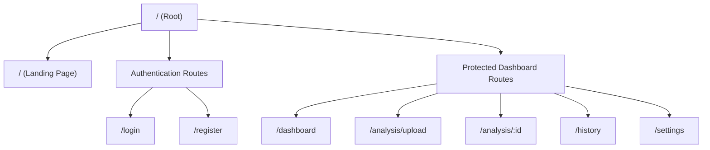

# Frontend Architecture: TNC Guardian

This document specifies the client-side frontend architecture for **TNC Guardian**, built on **React 18+**, **TypeScript (Strict Mode)**, **Vite**, **React Router v6**, and **TanStack Query v5**.

---

## 1. Directory Structure & Responsibilities

The client code resides in the `frontend/src/` folder. Responsibilities are split using Domain-Driven Feature design combined with global folders for base controls.

*   `assets/`: Storage for static items, brand logos, font configurations, and global CSS modules containing the design system's variables.
*   `components/`: Holds UI atoms and structural layouts shared globally across multiple features.
    *   `components/ui/`: Atomic, reusable presentation-only controls (e.g. `Button`, `Input`, `Dialog`, `Select`). Must depend only on Tailwind CSS properties, and be independent of the application state.
    *   `components/layout/`: Common structural segments such as the standard application header (`Navbar`), side panel links (`Sidebar`), and footer sections (`Footer`).
*   `config/`: Exposes environment configuration parameters (`env.ts`) and global constants (`constants.ts`).
*   `contexts/`: Manages global UI states and persistent credentials.
    *   `AuthContext.tsx`: Wraps the application to share current user details and tokens.
    *   `ThemeContext.tsx`: Manages the dark-mode configuration, writing preferences directly to DOM lists.
*   `features/`: Domain modules containing business components, hooks, type definitions, and API calls.
    *   `features/auth/`: Components and logic for registration, authentication forms, and passwords.
    *   `features/dashboard/`: Dashboard components, metric cards, credit displays, and history tables.
    *   `features/analysis/`: Ingest interfaces (drag-and-drop file uploaders, URL copy-paste forms) and analysis processing loaders.
    *   `features/results/`: UI for results visualizations: gauge score displays, simplified legal clause maps, and downloadable precaution checklist cards.
*   `hooks/`: Reusable, utility hooks (e.g., `useDebounce`, `useLocalStorage`).
*   `layouts/`: Root layouts defining page structures.
    *   `AppLayout.tsx`: Grid skeleton containing the sidebar, navbar, and nested feature viewport.
    *   `AuthLayout.tsx`: Dual-column wrapper displaying branding visual assets on one side and authentication forms on the other.
*   `pages/`: Raw page templates that mapping 1:1 with client routers. These templates import features and bind layouts.
*   `services/`: Communication layer containing API wrappers, routing setups, and security configurations.
*   `routes/`: Declares public routes, private route guards, and path structures.
*   `types/`: Centralized TypeScript declarations for data payloads.

---

## 2. Routing Design

We utilize **React Router v6** declarative nesting rules. Private screens are protected via route guards that verify the state of `AuthContext`.

### Route Map


### Route Guard Implementation Strategy
*   **`<ProtectedRoute>`**: Checks `isLoggedIn` and `isAuthLoading` from `AuthContext`. If loading, renders a full-page loading spinner. If unauthenticated, redirect to `/login` using the `<Navigate replace state={{ from: location }} />` pattern to support post-login returns.
*   **Lazy Loading**: Pages are loaded on-demand using `React.lazy()` and wrapped in a `<Suspense>` container with skeleton loaders, keeping the initial bundle size small.

---

## 3. State Management Paradigm

We split application state into two categories: **Server State** (cached database data) and **Client State** (temporary UI states).

```text
┌────────────────────────────────────────────────────────────────────────┐
│                              Application State                         │
├──────────────────────────────────────┬─────────────────────────────────┤
│             Server State             │           Client State          │
│          (TanStack Query)            │        (React Context / State)  │
├──────────────────────────────────────┼─────────────────────────────────┤
│  • User profile credentials          │  • Dark/Light theme mode toggles│
│  • Document analysis logs            │  • Upload processing states     │
│  • Stripe subscriptions statuses     │  • Mobile nav drawers state     │
│  • Usage tokens balances             │  • Local input fields states    │
└──────────────────────────────────────┴─────────────────────────────────┘
```

### A. Server State: TanStack Query (React Query)
All network interactions use custom React Query wrappers to manage caching and loading states automatically.
*   **Queries**: Fetch data (e.g., `GET /analysis`). Use standard stale times (e.g., 2 minutes) to prevent redundant network requests.
*   **Mutations**: Send updates (e.g., `POST /analysis/url`). On success, mutations invalidate relevant cache keys (e.g., calling `queryClient.invalidateQueries({ queryKey: ['history'] })`) to trigger automatic background updates.
*   **Polling (Async Job Processing)**: When loading an async OCR/video analysis, the results query uses React Query's `refetchInterval` option to poll `GET /analysis/{id}` every 3 seconds, disabling the loop once the returned status changes to `Completed` or `Failed`.

### B. Client State: React Context & Local State
*   **Contexts**: Reserved for long-lived settings that affect multiple components (e.g., authentication status and color theme settings).
*   **Local State (`useState`, `useReducer`)**: Used for transient UI states, such as active tab indexes, form inputs, modal toggles, and multi-step wizard stages.

---

## 4. Network Services Layer

Network calls are abstracted inside a service layer under the `services/` directory.

*   **`api-client.ts`**: Instantiates an **Axios** client configured with base URL headers, timeout limits (15s for API requests), and default credentials flags.
    *   **Request Interceptors**: Automatically read the JWT access token from application memory and insert the authorization header: `headers.Authorization = Bearer token`.
    *   **Response Interceptors (Automatic Token Refresh)**: Detects `401 Unauthorized` responses. Upon interception, the client pauses outstanding calls, triggers a token refresh request to `/auth/refresh` using the secure refresh cookie, updates the memory token, and retries the original request. If the refresh call fails, the interceptor clears the local auth state and redirects the user to `/login`.
*   **`auth-service.ts`**: Contains authentication methods (`login`, `register`, `logout`).
*   **`analysis-service.ts`**: Contains document analysis methods (`uploadFile`, `analyzeURL`, `getAnalysisResults`).
