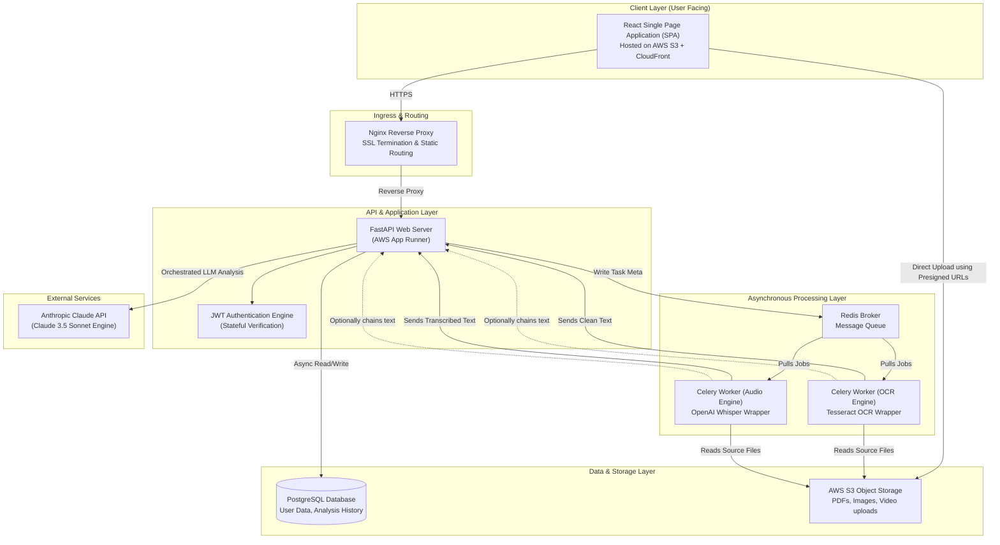

# System Architecture: TNC Guardian

This document defines the high-level system architecture of **TNC Guardian**. The system is built around a decoupled client-server pattern designed to handle high-throughput asynchronous workloads (like OCR and audio/video processing) without degrading API response times.

---

## 1. Architectural Diagram

The diagram below represents the system's layout, communication protocols, and execution workflows.

---

## 2. Component Descriptions

### A. Frontend (Client Layer)
*   **Role**: Serves the user interface to students, professionals, and small businesses.
*   **Infrastructure**: Packaged as a static bundle using Vite and distributed globally through **Amazon CloudFront** using **Amazon S3** as the source bucket.
*   **Interaction**: The client directly interacts with the API gateway via HTTPS. For file uploads (PDF, Screenshot, Video), the frontend requests a temporary **Presigned Upload URL** from the backend API, allowing files to be written directly to the S3 bucket. This prevents massive binary streams from consuming server memory.

### B. Backend API Gateway (Application Layer)
*   **Role**: Handles routing, user registration, token management, dashboard listing, settings modifications, and analysis orchestrations.
*   **Infrastructure**: Built using **FastAPI** and deployed as a load-balanced auto-scaling service in **AWS App Runner**.
*   **Interaction**: Handles client requests. When a simple text/URL analysis is requested, the backend handles the analysis synchronously (fetching the text and sending it directly to the Claude API). When files require OCR or transcription, the backend writes a job profile to the database, queues a job token in Redis, and returns a transaction ID to the client immediately.

### C. Authentication Service
*   **Role**: Validates user credentials, sets session durations, and guards private routes.
*   **Mechanism**: Implements stateless JWT authentication. Standard signup/signin responses return a signed access token (15-minute lifetime, stored in memory) and a secure, HttpOnly, SameSite, encrypted refresh token cookie (7-day lifetime) used to renew access tokens automatically.

### D. Message Broker & Task Queue (Asynchronous Layer)
*   **Role**: Schedules and routes heavy computing operations.
*   **Mechanism**: Uses **Redis** as a key-value store and message broker alongside **Celery** workers. The application separates tasks into specific queues (`ocr-queue` for screenshots/PDFs, `audio-queue` for video transcriptions) so worker nodes can scale independently based on the type of incoming traffic.

### E. OCR and Speech Workers
*   **OCR Worker**: Utilizes Tesseract OCR to read flat screenshots. It downloads target images from S3, pre-processes pixels using OpenCV (contrast optimization, thresholding), extracts textual sections, and uploads the reconstructed legal text to the backend.
*   **Speech Worker**: Runs Whisper to translate voice files extracted from user videos (screen recordings). It converts videos to raw mono audio, runs audio transcription, indexes the results with timestamp markings, and forwards the text to the backend database.

### F. External LLM Engine
*   **Role**: Translates, extracts, and summarizes document texts.
*   **Mechanism**: Communicates with the **Anthropic Claude API** (Claude 3.5 Sonnet). The API sends the cleaned legal text combined with strict system prompts that require JSON responses matching Pydantic-defined structures. A custom model abstraction wrapper intercepts these calls, permitting rapid failover to alternative providers (such as OpenAI or Google Vertex AI).

### G. Database Layer
*   **Role**: Retains structured records.
*   **Infrastructure**: Deployed on **AWS RDS PostgreSQL**. It retains indexes on user profiles, analysis history metadata, files logs, subscription levels, usage tracking quotas, and settings. Large LLM summary details are stored in Postgres `JSONB` columns to retain flexibility without database bloat.

### H. Object Storage
*   **Role**: Stores binary documents safely.
*   **Infrastructure**: **AWS S3**. Storage buckets implement lifecycle configurations (e.g., automatically deleting raw analysis video files after 7 days to protect user privacy and minimize storage costs).

---

## 3. Core Operational Workflows

### Text & URL Analysis (Synchronous)
1. User enters a URL on the React frontend.
2. Frontend triggers `POST /api/v1/analysis/url` to the backend.
3. Backend fetches the web page, cleans the HTML markup to extract plain legal text, and passes it to the Claude API helper.
4. Claude API returns a structured JSON payload detailing identified risks, categories, simplified translations, and recommendations.
5. Backend logs the metadata into PostgreSQL and returns the details to the client.

### Image & Video Analysis (Asynchronous)
1. User uploads a video of their terms scrolling sequence.
2. Frontend requests an upload ticket: `POST /api/v1/files/upload-ticket`.
3. Backend generates and returns an S3 presigned upload URL.
4. Frontend uploads the raw video file directly to the S3 bucket.
5. Frontend calls the analysis launcher: `POST /api/v1/analysis/file` with the S3 file reference.
6. Backend creates a pending record in PostgreSQL, pushes task tokens to Redis, and returns a tracking UUID `analysis_id` to the client.
7. Celery worker pulls the task, pulls the raw video from S3, splits the audio track, runs Whisper transcription, and runs Tesseract OCR on video frames.
8. The worker merges the text outputs, saves the aggregated raw text to S3, and calls an internal worker webhook to trigger the LLM stage.
9. Backend reads the aggregated text, sends it to Claude, stores the returned analysis results in the database, and flags the database entry as `Completed`.
10. Frontend, polling `GET /api/v1/analysis/{analysis_id}` (or listening via a WebSocket connection), displays the completed analysis dashboard.
