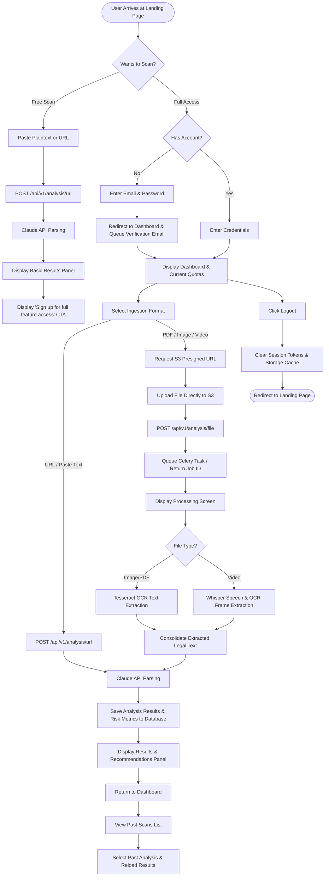

# User Flow & Interaction: TNC Guardian

This document defines the step-by-step user journey within **TNC Guardian**, describing page transitions, user options, and processing sequences.

---

## 1. User Journey Sequence

### A. Landing Page
*   **Action**: User visits `https://tnc-guardian.com`.
*   **Experience**: View the hero section detailing value propositions, risk scoring examples, and plan features.
*   **Decision**: 
    *   Click "Analyze Free" to test the tool with plain text inputs (no authentication required, limited context size).
    *   Click "Login" or "Get Started" to navigate to authentication views.

### B. Signup & Registration
*   **Action**: User clicks "Get Started" and is redirected to the Auth Layout page.
*   **Experience**: Submits email and sets a password.
*   **Transition**: An activation email is queued, and the user is redirected to the Dashboard.

### C. Dashboard Hub
*   **Action**: Landing dashboard for authenticated users.
*   **Experience**: View current subscription tier, scan quota credit balance, a history table of past scans, and the main "Analyze New Document" launcher.
*   **Decision**: Click "Analyze New Document" to launch the analysis configuration view.

### D. Analysis Input Config & Upload
*   **Action**: Choose analysis input format: Paste URL, Paste Plaintext, Upload PDF, Upload Image (Screenshot), or Upload Video (Screen Recording).
*   **Ingest Processing**:
    *   *URL/Text Input*: Send directly to the API for synchronous analysis.
    *   *File Upload (PDF, Image, Video)*: The client obtains an S3 presigned URL, uploads the file directly to S3, and notifies the API to start an asynchronous analysis job.
    *   *Redirect*: The UI redirects the user to the analysis progress screen for their new job ID.

### E. Background Processing Loop (OCR & Transcription)
*   **Action**: The frontend displays a loading page with progress milestones while polling the job status.
*   **System Processing**:
    *   *PDF/Image*: OCR extracts terms text from images/PDF blocks.
    *   *Video*: The audio track is isolated, Whisper transcribes spoken disclosures, and OCR reads text from video frames.
    *   *LLM Stage*: Extracted text is consolidated, analyzed by the Claude API, and saved to the database.

### F. Results Visualizer
*   **Action**: Display analysis results.
*   **Experience**:
    *   **Risk Gauge**: Displays the risk score (0-100) with color indicators (Red: Critical, Orange: High, Yellow: Medium, Green: Low).
    *   **Simplified Read**: Shows a side-by-side view comparing original legalese blocks with simple English summaries.
    *   **Precautionary Checklist**: Provides custom checkboxes with actionable safety recommendations.

### G. Historical Archives
*   **Action**: User returns to the dashboard and checks historical entries.
*   **Experience**: Can filter past records by name, date range, and risk level. Clicking an entry reloads its results visualization page.

### H. Account Session Terminate
*   **Action**: User clicks the "Logout" button.
*   **Experience**: Invalidate JWT session tokens, clear local cache states, and redirect the user back to the landing page.

---

## 2. Interaction Flowchart

The flowchart below traces user choices, system routing checks, and background execution states.

